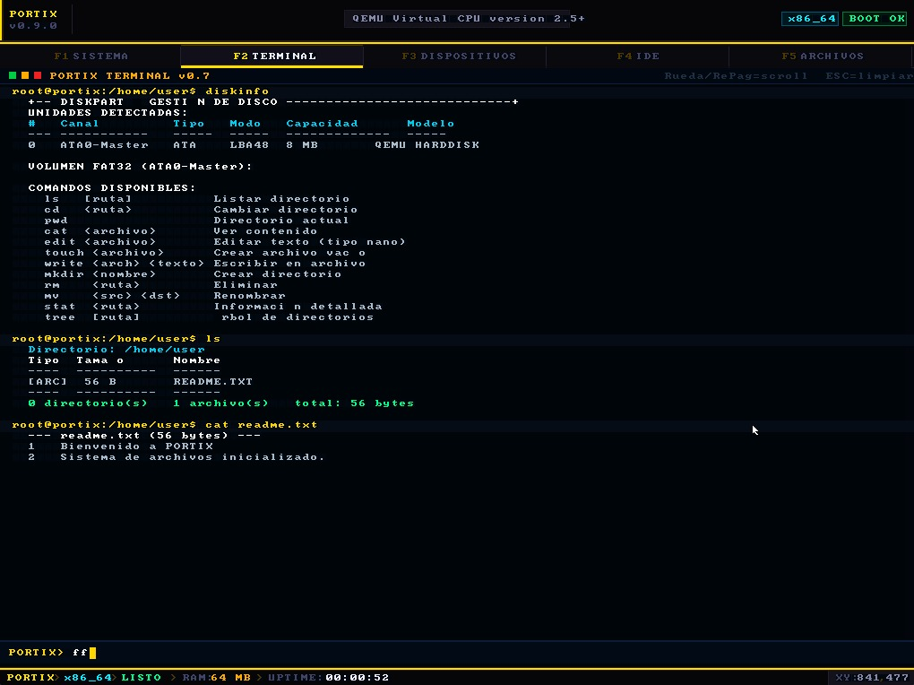
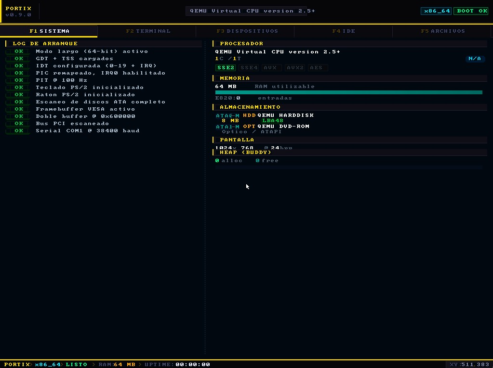

# 🌌 Portix OS

Un Kernel x86_64 de alto rendimiento escrito en Rust, nacido en el metal y forjado en el aprendizaje constante.

---

## 👨‍💻 Cómo Inició

Portix no comenzó con la idea de crear un sistema operativo completo.

Al inicio, mi único objetivo era algo mucho más simple:  
compilar un binario básico que mostrara un **"Hola Mundo"** en VGA usando **ASM y Rust**, entender el proceso de booteo desde cero y ver código propio ejecutándose directamente sobre el hardware.

Lo que empezó como curiosidad por:

- Cómo la CPU pasa de Real Mode a Long Mode  
- Cómo escribir texto directamente en la memoria VGA  
- Cómo enlazar ASM con Rust en `no_std`  
- Cómo generar un binario arrancable sin GRUB  

...terminó convirtiéndose en una arquitectura completa.

Mientras otros usan capas de abstracción pesadas, mi enfoque con Portix siempre fue la pureza técnica:

- **Cero dependencias innecesarias:** El kernel compila con un stack mínimo (`no_std`), manteniendo control total sobre cada ciclo de instrucción.  
- **Bootloader propio:** Nada de GRUB o Limine de terceros; Portix arranca desde BIOS Legacy mediante un stack de arranque diseñado a medida.  
- **Compromiso con la 1.0:** Este no es un proyecto escolar de una semana; es un trabajo de largo aliento donde la eficiencia de Rust es el motor principal.  

Lo que era un simple experimento terminó evolucionando en un sistema operativo modular.

---

## 🛠️ Características Actuales

Portix salta directamente a **Modo Largo (64-bit)**, gestionando el hardware de forma cruda y sin intermediarios.

### 🧠 Gestión de Memoria Avanzada

Implementación de un **Buddy System Allocator** con listas intrusivas.  
Permite una asignación de bloques dinámica y eficiente, minimizando la fragmentación externa (vital cuando cada byte cuenta).

### 🔌 Arquitectura de Drivers y VFS

- **Almacenamiento Pro:**  
  Driver ATA con sistema de caché inteligente para evitar resets de bus y soporte para ISO9660 (El Torito) y FAT32.

- **Gráficos & UI:**  
  Framebuffer VESA de alto rendimiento con Alpha Blending para una interfaz moderna y fluida.  
  Capa de UI propia con sistema de pestañas.

- **Sistema de Archivos:**  
  Capa VFS unificada que abstrae los sistemas de archivos de manera transparente para el usuario.

---

## 💾 Soporte para Virtualización

Portix puede ejecutarse y distribuirse en múltiples formatos compatibles con entornos virtualizados:

- 🖥️ **ISO (CD-ROM Boot)**
- 💽 **RAW (Disco crudo)**
- 🧩 **VMI** (Virtual Machine Image)
- 🧱 **VMDK** (Compatible con VMware y otros hipervisores)

Esto permite probar Portix fácilmente en diferentes entornos como QEMU, VMware y otros sistemas de virtualización.

---

## 🏗️ Estructura del Proyecto

La arquitectura de Portix está modularizada para separar la comunicación directa con el silicio de la lógica de alto nivel:

---

```text
├── boot/                  # Stack de arranque custom (ASM)
│   ├── boot.asm
│   └── stage2.asm
├── kernel/                # Núcleo del SO
│   ├── Cargo.toml
│   ├── linker.ld
│   └── src/
│       ├── arch/          # Puente con el hardware (IDT, GDT, ISR)
│       ├── console/       # Terminal y comandos (debug, disk, system...)
│       │   └── terminal/
│       │       └── commands/
│       ├── drivers/       # Control de periféricos
│       │   ├── bus/       # ACPI, PCI
│       │   ├── input/     # PS/2 Teclado y Ratón
│       │   └── storage/   # ATA, FAT32, VFS, mkfs
│       ├── graphics/      # Framebuffer y Renderizado
│       │   ├── driver/    # VESA, VGA
│       │   └── render/    # Fuentes y tipografía
│       ├── mem/           # Buddy Allocator y Heap
│       ├── time/          # Temporizadores (PIT)
│       ├── ui/            # Interfaz visual de usuario (Tabs, Chrome)
│       └── util/          # Utilidades y formateo
└── main.rs
```
---

  


---

## 🚀 Guía de Ejecución (QEMU)

Portix es versátil. Puedes probarlo en distintos modos según el medio que prefieras:

| Modo de Arranque | Comando Destacado |
|------------------|------------------|
| CD-ROM (ISO) | `python scripts/build.py --mode=iso` |
| Disco IDE (RAW) | `python scripts/build.py --mode=raw` |
| VMDK (VMware) | `python scripts/build.py --mode=vmdk` |
| VMI | `python scripts/build.py --mode=vmi` |

> 💡 **TIP:**  
> Revisa los scripts en `/scripts` para automatizar la construcción.  
> El kernel se compila con `rust-nightly` para aprovechar las últimas optimizaciones de `no_std`.

---

## 🤝 Contributing

Portix cuenta con un archivo [`CONTRIBUTING.md`](CONTRIBUTING.md) donde se detallan:

- Estándares de código  
- Convenciones de commits  
- Flujo de Pull Requests  
- Reglas de arquitectura  
- Buenas prácticas para desarrollo en `no_std`  

Si quieres contribuir, por favor revisa ese documento antes de enviar un PR.

---

## 💬 Contribuciones y Visión

Si te apasiona el desarrollo de sistemas, la seguridad de memoria y el bajo nivel, eres bienvenido.  
Actualmente el proyecto está en una fase de desarrollo muy activa (y a veces inestable), por lo que los PRs y discusiones son más que bienvenidos.

Portix es una prueba de que con Rust y curiosidad, se pueden alcanzar niveles de ingeniería profesional desde cero.

---

**Desarrollado con pasión por Omar Palomares Velasco**

> _"Tardará lo que tenga que tardar, pero la 1.0 será perfecta."_