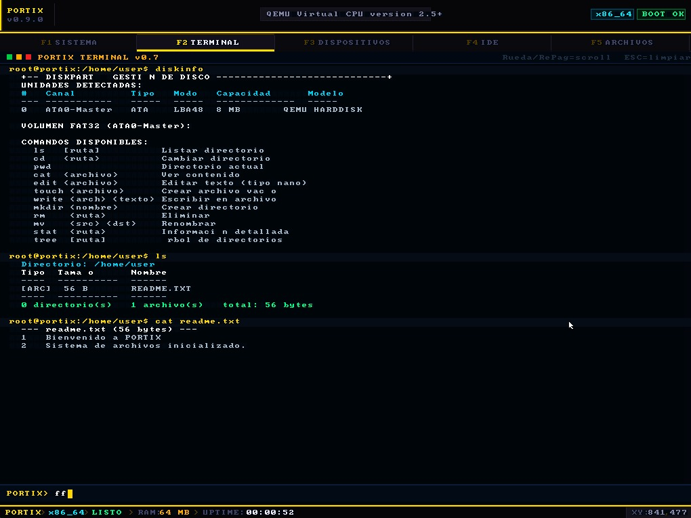
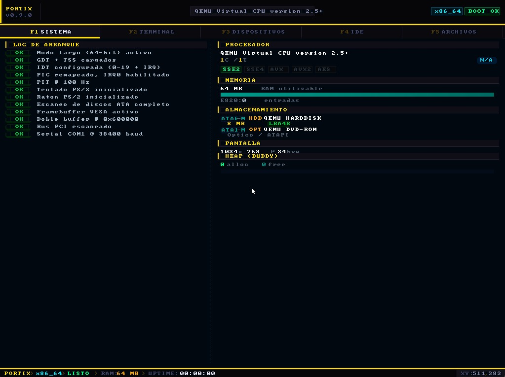

# 🌌 Portix OS

<div align="center">


**Un kernel x86_64 escrito en Rust desde cero — sin libc, sin GRUB, sin Nada Todo Construido Desde 0.**

*Arranca en BIOS y UEFI. Gestiona memoria, drivers y una UI propia.*  
*Construido con curiosidad, mantenido con obsesión.*

</div>

---

## Tabla de contenidos

- [🌌 Portix OS](#-portix-os)
  - [Tabla de contenidos](#tabla-de-contenidos)
  - [🌌 ¿Qué es Portix?](#-qué-es-portix)
  - [👨‍💻 Cómo inició](#-cómo-inició)
  - [🏛️ Arquitectura técnica](#️-arquitectura-técnica)
    - [Flujo de arranque](#flujo-de-arranque)
    - [Mapa de memoria (en ejecución)](#mapa-de-memoria-en-ejecución)
    - [GOP / VBE Fallback](#gop--vbe-fallback)
    - [IDT / GDT / ISR](#idt--gdt--isr)
  - [🛠️ Características actuales](#️-características-actuales)
    - [Gestión de memoria](#gestión-de-memoria)
    - [Drivers](#drivers)
    - [Gráficos y UI](#gráficos-y-ui)
  - [📁 Estructura del proyecto](#-estructura-del-proyecto)
  - [💾 Soporte de arranque y virtualización](#-soporte-de-arranque-y-virtualización)
  - [🚀 Guía de ejecución (QEMU)](#-guía-de-ejecución-qemu)
  - [📸 Screenshots](#-screenshots)
  - [🤝 Contribuir](#-contribuir)
  - [👤 Autor](#-autor)
  - [📄 Licencia](#-licencia)

---

## 🌌 ¿Qué es Portix?

Portix es un sistema operativo experimental de **64 bits** escrito completamente en **Rust freestanding** (`no_std`).

No usa Linux, no usa libc, no usa ningún bootloader de terceros.  
Cada pieza — desde el MBR hasta la UI — existe porque fue escrita para este proyecto.

| Propiedad | Valor |
|-----------|-------|
| Arquitectura objetivo | x86\_64 |
| Lenguaje principal | Rust (nightly) |
| Bootloader | Custom (ASM propio) |
| Modo de CPU | Long Mode (64-bit) |
| Boot targets | BIOS Legacy + UEFI |
| Interfaz | Framebuffer, 5 pestañas |

---

## 👨‍💻 Cómo inició

Portix no comenzó con la idea de crear un sistema operativo completo.

El objetivo inicial era uno solo: compilar un binario que mostrara **"Hola Mundo"** en VGA usando ASM y Rust, entender el proceso de booteo desde cero, y ver código propio ejecutándose directamente sobre el hardware.

Cuatro preguntas lo desencadenaron todo:

- ¿Cómo pasa la CPU de Real Mode a Long Mode?
- ¿Cómo se escribe texto directamente en memoria VGA?
- ¿Cómo se enlaza ASM con Rust en `no_std`?
- ¿Cómo se genera un binario arrancable sin GRUB?

Lo que empezó como un experimento terminó en una arquitectura completa.  
El principio que guía cada decisión sigue siendo el mismo: **pureza técnica, cero capas innecesarias**.

---

## 🏛️ Arquitectura técnica

### Flujo de arranque

```
┌──────────────────────────────────────────────────────────────────┐
│  BIOS (Legacy)                                                   │
│                                                                  │
│  MBR (512 B)  →  stage2.asm (32 KB)  →  VESA 1024×768           │
│                                      →  kernel ELF @ 0x200000   │
└──────────────────────────────────────────────────────────────────┘

┌──────────────────────────────────────────────────────────────────┐
│  UEFI                                                            │
│                                                                  │
│  GPT ESP  →  BOOTX64.EFI (Rust puro, extern "efiapi")           │
│           →  Block I/O + FAT32  →  PortixBootInfo               │
│           →  ExitBootServices   →  kernel ELF @ 0x200000        │
└──────────────────────────────────────────────────────────────────┘
```

> El loader UEFI usa `extern "efiapi"` (convención Microsoft x64: RCX, RDX, R8, R9)  
> sin ningún crate externo — llamadas directas a la UEFI boot table.

### Mapa de memoria (en ejecución)

```
0x000000 ── 0x0FFFFF   Primer megabyte (BIOS, VGA, reservado)
0x100000 ── 0x1FFFFF   Backbuffer de video (doble buffer)
0x200000 ──            Kernel (código + datos + heap)
```

### GOP / VBE Fallback

OVMF (UEFI en Windows) no siempre expone el protocolo GOP.  
Portix maneja esto en dos capas para que el display **siempre funcione**:

```
Loader UEFI
  │
  ├── GOP disponible?  →  fb_ok = true  →  framebuffer directo
  │
  └── GOP no disponible?  →  fb_ok = false
        │
        └── Kernel detecta lfb == 0
              │
              └── Escaneo PCI  →  VBE activo?
                    ├── Sí  →  usar framebuffer existente
                    └── No  →  init VBE a 1024×768×32
```

### IDT / GDT / ISR

Manejo robusto de excepciones del CPU con IDT completa.  
Cada ISR imprime el registro de contexto vía serial antes de haltear.

---

## 🛠️ Características actuales

### Gestión de memoria

- **Buddy System Allocator** con listas intrusivas — asignación dinámica de bloques, fragmentación externa mínima
- Monitoreo de heap en tiempo real desde la pestaña **System**
- Identity map del bootloader (paginación virtual: roadmap)

### Drivers

| Driver | Estado | Detalles |
|--------|--------|----------|
| ATA PIO | ✅ | LBA48, caché de sectores para evitar resets de bus |
| FAT32 | ✅ | Read/write, cluster chain completo |
| VFS | ✅ | Capa unificada que abstrae los filesystems |
| PCI | ✅ | Escaneo completo del bus |
| PS/2 Teclado | ✅ | IRQ1 |
| PS/2 Mouse | ✅ | IRQ12 |
| PIT | ✅ | 100 Hz tick |
| Serial | ✅ | COM1 38400 8N1, niveles de log, volcado hex, self-test |

### Gráficos y UI

- Framebuffer vía VESA, GOP, o PCI+VBE fallback
- Doble buffer con dirty region blit (backbuffer @ `0x100000`)
- Alpha blending para rectángulos
- Layout proporcional — sin coordenadas hardcodeadas

**5 pestañas de interfaz:**

| Pestaña | Función |
|---------|---------|
| System | Telemetría de heap, CPU, memoria |
| Terminal | Consola interactiva + comandos de disco |
| Devices | Listado de dispositivos PCI / ATA detectados |
| IDE | Editor de texto integrado (estilo nano) |
| Explorer | Navegador de archivos FAT32 |

---

## 📁 Estructura del proyecto

```text
portix/
├── boot/                        # Stack de arranque custom
│   ├── boot.asm                 # MBR — primera etapa (512 B)
│   ├── stage2.asm               # Segunda etapa — Long Mode + VESA
│   └── efi/                     # Loader UEFI en Rust puro
│       └── src/main.rs
│
├── kernel/
│   ├── Cargo.toml
│   ├── linker.ld                # Linker script custom
│   └── src/
│       ├── arch/                # IDT, GDT, ISR — puente con el hardware
│       ├── console/             # Terminal e intérprete de comandos
│       │   └── terminal/
│       │       └── commands/
│       ├── drivers/
│       │   ├── bus/             # ACPI, PCI
│       │   ├── input/           # PS/2 teclado y ratón
│       │   └── storage/         # ATA, FAT32, VFS, mkfs
│       ├── graphics/
│       │   ├── driver/          # VESA, VGA, framebuffer
│       │   └── render/          # Fuentes, tipografía, alpha blend
│       ├── mem/                 # Buddy Allocator, heap
│       ├── time/                # PIT, temporizadores
│       ├── ui/                  # Chrome de UI, sistema de pestañas
│       └── util/                # Utilidades y formateo
│
├── scripts/
│   └── build.py                 # Script de build y lanzamiento QEMU
│
└── main.rs
```

---

## 💾 Soporte de arranque y virtualización

Portix genera imágenes en múltiples formatos para distintos entornos:

| Formato | Descripción | Comando |
|---------|-------------|---------|
| UEFI | GPT + ESP, requiere OVMF | `--mode=uefi` |
| Dual | BIOS + UEFI en un artefacto | `--mode=dual` |
| RAW | Imagen de disco crudo | `--mode=raw` |
| VMDK | Compatible con VMware | `--mode=vmdk` |
| VMI | Virtual Machine Image | `--mode=vmi` |

Compatible con **QEMU**, **VMware**, y cualquier hipervisor que soporte VMDK o ISO.

---

## 🚀 Guía de ejecución (QEMU)

```sh
# Limpiar artefactos anteriores
python scripts/build.py --clean

# Modo BIOS — ISO El Torito
python scripts/build.py --mode=bios ---format=iso

# Modo UEFI — GPT + ESP (requiere OVMF + pyfatfs)
python scripts/build.py --mode=uefi ---format=iso

# Ambos modos
python scripts/build.py --mode=dual
```

> La salida serial de debug aparece directamente en la terminal via `-serial stdio`.  
> Para instalar las dependencias necesarias consulta [`PREREQUISITES.md`](PREREQUISITES.md).

---

## 📸 Screenshots

| Terminal | System |
|----------|--------|
|  |  |

---

## 🤝 Contribuir

Las contribuciones son bienvenidas. Antes de enviar un PR, revisa [`CONTRIBUTING.md`](CONTRIBUTING.md) donde se detallan:

- Estándares de código y convenciones de commits
- Flujo de Pull Requests
- Reglas de arquitectura del kernel
- Buenas prácticas para desarrollo en `no_std`

Si tienes dudas, abre un **Issue** primero. El proyecto está en fase activa y a veces inestable — las discusiones técnicas son más que bienvenidas.

---

## 👤 Autor

<div align="center">

**Omar Palomares Velasco**

Portix es la prueba de que con curiosidad y disciplina  
se pueden alcanzar niveles de ingeniería profesional construyendo desde cero.

> *"Tardará lo que tenga que tardar, pero la 1.0 será perfecta."*

</div>

---

## 📄 Licencia

Portix OS se distribuye bajo la licencia **GNU General Public License v3.0**.

Puedes usar, modificar y distribuir este software siempre que las obras derivadas  
se publiquen bajo la misma licencia.  
Consulta el archivo [`LICENSE`](LICENSE) para los términos completos.

---

<div align="center">

*Construido con Rust, ASM, y demasiadas horas frente al debugger serial.*

</div>
